# Diagram Autentykacji - HealthyMeal

## Przegląd

Ten diagram przedstawia kompletny przepływ autentykacji w aplikacji HealthyMeal, wykorzystującej Astro 5, React 19 i Supabase Auth. Diagram obejmuje wszystkie kluczowe scenariusze:

- Rejestracja użytkownika
- Logowanie
- Zarządzanie sesją i weryfikacja tokenów
- Automatyczne odświeżanie tokenów
- Wylogowanie
- Reset hasła (żądanie i potwierdzenie)
- Ochrona chronionych zasobów

## Aktorzy

1. **Przeglądarka** - Interfejs użytkownika, formularze, przechowywanie cookie
2. **Middleware** - Warstwa weryfikacji sesji w Astro
3. **Astro API** - Endpointy API do obsługi żądań autentykacji
4. **AuthService** - Warstwa logiki biznesowej
5. **Supabase Auth** - Zewnętrzna usługa autentykacji
6. **Baza Danych** - PostgreSQL z tabelami auth.users i public.profiles

## Diagram sekwencji

```mermaid
sequenceDiagram
    autonumber
    participant B as Przeglądarka
    participant M as Middleware
    participant API as Astro API
    participant AS as AuthService
    participant SA as Supabase Auth
    participant DB as Baza Danych

    Note over B,DB: PRZEPŁYW REJESTRACJI

    B->>B: Wypełnienie formularza rejestracji
    B->>B: Walidacja Zod Schema
    B->>API: POST /api/auth/register
    Note right of B: { email, password }

    API->>API: Walidacja danych wejściowych
    API->>AS: register(email, password)
    AS->>SA: auth.signUp()
    SA->>SA: Haszowanie hasła (bcrypt)
    SA->>DB: Utworzenie użytkownika w auth.users
    DB->>DB: Trigger tworzy profil w public.profiles
    SA->>SA: Generowanie JWT access token
    SA->>SA: Generowanie refresh token
    SA-->>AS: { user, session }
    AS-->>API: { user }
    API->>API: Ustawienie cookie sesji
    API-->>B: 201 Created + Set-Cookie
    B->>B: navigate('/recipes')

    Note over B,DB: PRZEPŁYW LOGOWANIA

    B->>B: Wypełnienie formularza logowania
    B->>API: POST /api/auth/login
    Note right of B: { email, password }

    API->>AS: login(email, password)
    AS->>SA: auth.signInWithPassword()
    SA->>DB: Weryfikacja w auth.users

    alt Prawidłowe dane
        SA->>SA: Generowanie tokenów JWT
        SA-->>AS: { user, session }
        AS-->>API: { user }
        API->>API: Ustawienie cookie sesji
        API-->>B: 200 OK + Set-Cookie
        B->>B: navigate('/recipes')
    else Nieprawidłowe dane
        SA-->>AS: AuthError
        AS-->>API: UnauthorizedError
        API-->>B: 401 Unauthorized
        B->>B: Wyświetlenie błędu
    end

    Note over B,DB: PRZEPŁYW ZARZĄDZANIA SESJĄ

    B->>M: GET /recipes + Cookie
    M->>M: Utworzenie klienta Supabase
    M->>SA: auth.getSession()
    SA->>SA: Weryfikacja podpisu JWT
    SA->>SA: Sprawdzenie wygaśnięcia tokenu

    alt Token ważny
        SA-->>M: { session, user }
        M->>M: Ustawienie locals.user
        M->>M: Ustawienie locals.session
        M->>API: next()
        API->>API: Przetworzenie żądania
        API->>API: Użycie locals.user.id
        API-->>B: 200 OK + dane
    else Token wygasły lub brak
        SA-->>M: { session: null }
        M->>M: locals.user = null
        M-->>B: Redirect /login?returnUrl=/recipes
    end

    Note over B,DB: PRZEPŁYW ODŚWIEŻANIA TOKENU

    B->>M: Żądanie z wygasającym tokenem
    M->>SA: auth.getSession()
    SA->>SA: Wykrycie zbliżającego się wygaśnięcia
    SA->>SA: Weryfikacja refresh token

    alt Refresh token ważny
        SA->>SA: Generowanie nowego access token
        SA->>SA: Generowanie nowego refresh token
        SA-->>M: { session } + nowe tokeny
        M->>M: Aktualizacja cookie
        M->>API: next()
        API-->>B: 200 OK + Set-Cookie
    else Refresh token wygasły
        SA-->>M: { session: null }
        M-->>B: Redirect /login
    end

    Note over B,DB: PRZEPŁYW WYLOGOWANIA

    B->>API: POST /api/auth/logout + Cookie
    API->>AS: logout()
    AS->>SA: auth.signOut()
    SA->>SA: Unieważnienie tokenów sesji
    SA-->>AS: OK
    AS-->>API: void
    API->>API: Wyczyszczenie cookie sesji
    API-->>B: 200 OK + Clear-Cookie
    B->>B: navigate('/')

    Note over B,DB: PRZEPŁYW RESETU HASŁA - ŻĄDANIE

    B->>B: Wypełnienie formularza z emailem
    B->>API: POST /api/auth/reset-password-request
    Note right of B: { email }

    API->>AS: requestPasswordReset(email)
    AS->>SA: auth.resetPasswordForEmail()
    SA->>SA: Generowanie jednorazowego tokenu
    SA->>SA: Wysłanie emaila z linkiem
    Note right of SA: Link: /reset-password#token=XXX
    SA-->>AS: OK
    AS-->>API: void
    API-->>B: 200 OK
    Note left of B: Generyczna wiadomość<br/>bez ujawnienia istnienia konta

    Note over B,DB: PRZEPŁYW RESETU HASŁA - POTWIERDZENIE

    B->>B: Kliknięcie linku w emailu
    B->>B: Wykrycie tokenu w URL hash
    B->>B: Wypełnienie formularza nowego hasła
    B->>API: POST /api/auth/reset-password-confirm
    Note right of B: { token, password }

    API->>AS: confirmPasswordReset(token, password)
    AS->>SA: auth.updateUser({ password })
    SA->>SA: Weryfikacja tokenu

    alt Token ważny
        SA->>SA: Haszowanie nowego hasła
        SA->>DB: Aktualizacja hasła w auth.users
        SA->>SA: Unieważnienie tokenu resetu
        SA-->>AS: OK
        AS-->>API: void
        API-->>B: 200 OK
        B->>B: navigate('/login')
    else Token wygasły lub nieważny
        SA-->>AS: AuthError
        AS-->>API: BadRequestError
        API-->>B: 400 Bad Request
        B->>B: Wyświetlenie błędu
    end

    Note over B,DB: OCHRONA CHRONIONYCH ZASOBÓW

    B->>M: GET /recipes (bez cookie)
    M->>SA: auth.getSession()
    SA-->>M: { session: null }
    M->>M: Sprawdzenie czy ścieżka chroniona
    M->>M: Kodowanie returnUrl
    M-->>B: Redirect /login?returnUrl=/recipes

    Note over B,M: Po zalogowaniu użytkownik<br/>wraca do /recipes
```



## Kluczowe elementy bezpieczeństwa

### Tokeny i sesje
- **Access Token**: JWT ważny przez 1 godzinę (3600s)
- **Refresh Token**: Ważny przez 7 dni (604800s)
- **Cookie**: HttpOnly, Secure, SameSite=Lax

### Weryfikacja
- Podpis JWT (HMAC SHA-256)
- Sprawdzenie wygaśnięcia (exp claim)
- Weryfikacja wydawcy (iss claim)
- Weryfikacja użytkownika (sub claim)

### Ochrona
- Rate limiting na endpointach auth
- Generyczne komunikaty błędów (zapobieganie enumeracji)
- CSRF protection (SameSite cookies)
- XSS protection (HttpOnly cookies)
- Row Level Security (RLS) w bazie danych

## Przepływy danych

### Cookie sesji
```
sb-{project-ref}-auth-token: {access_token}
- HttpOnly: true (JavaScript nie ma dostępu)
- Secure: true (tylko HTTPS w produkcji)
- SameSite: Lax (ochrona CSRF)
- Path: /
- Max-Age: 3600s (1 godzina)
```

### Struktura JWT
```json
{
  "sub": "user-uuid",
  "email": "user@example.com",
  "role": "authenticated",
  "iat": 1234567890,
  "exp": 1234571490,
  "iss": "supabase"
}
```

## Ścieżki publiczne i chronione

### Publiczne (brak wymaganej autentykacji)
- `/` - strona główna
- `/login` - logowanie
- `/register` - rejestracja
- `/reset-password` - reset hasła
- `/api/auth/*` - wszystkie endpointy auth

### Chronione (wymagana autentykacja)
- `/recipes` - lista przepisów
- `/recipes/new` - nowy przepis
- `/recipes/[id]` - szczegóły przepisu
- `/profile` - profil użytkownika
- `/api/recipes*` - API przepisów
- `/api/profile/*` - API profilu

## Obsługa błędów

### Kody HTTP
- `200 OK` - Sukces
- `201 Created` - Użytkownik utworzony
- `400 Bad Request` - Błędne dane wejściowe
- `401 Unauthorized` - Nieprawidłowe dane logowania
- `409 Conflict` - Email już istnieje
- `429 Too Many Requests` - Rate limit przekroczony
- `500 Internal Server Error` - Błąd serwera

### Komunikaty użytkownika
- **Login failed**: "Invalid email or password"
- **Email exists**: "An account with this email already exists"
- **Reset email sent**: "If an account exists with this email, you will receive a reset link shortly"
- **Token invalid**: "This reset link is invalid or has expired"
- **Session expired**: "Your session has expired. Please log in again"

## Notatki implementacyjne

1. **Middleware** weryfikuje każde żądanie przed jego przetworzeniem
2. **AuthService** enkapsuluje logikę Supabase Auth
3. **RLS Policies** zapewniają izolację danych na poziomie bazy danych
4. **Automatic token refresh** działa transparentnie w tle
5. **Return URL** zachowuje kontekst nawigacji po zalogowaniu
6. **Database triggers** automatycznie tworzą profile dla nowych użytkowników

---

**Data utworzenia**: 2025-12-17
**Wersja specyfikacji**: 1.0
**Zgodność z**: PRD v1.0, Auth Specification v1.0
