# Diagram Podróży Użytkownika - HealthyMeal

## Przegląd

Ten diagram przedstawia kompleksową podróż użytkownika w aplikacji HealthyMeal od pierwszego kontaktu ze stroną główną, przez proces rejestracji/logowania, aż po korzystanie z głównych funkcji aplikacji. Diagram skupia się na aspektach biznesowych i doświadczeniu użytkownika, nie na szczegółach technicznych.

## Główne podróże użytkownika

### 1. Nowy użytkownik (First-time User)
- Wejście na landing page
- Rejestracja konta
- Automatyczne logowanie
- Onboarding (pusty stan)
- Utworzenie pierwszego przepisu
- Konfiguracja preferencji dietetycznych

### 2. Powracający użytkownik (Returning User)
- Wejście na landing page
- Logowanie
- Dashboard z listą przepisów
- Zarządzanie przepisami
- Korzystanie z funkcji AI

### 3. Odzyskiwanie dostępu (Password Recovery)
- Zapomniałem hasła
- Żądanie resetu
- Email z linkiem
- Ustawienie nowego hasła
- Logowanie

### 4. Zarządzanie przepisami (Recipe Management)
- Przeglądanie listy
- Tworzenie nowego przepisu
- Edycja przepisu
- Modyfikacja AI
- Usuwanie przepisu

### 5. Zarządzanie profilem (Profile Management)
- Dostęp do profilu
- Edycja preferencji dietetycznych
- Zapisanie zmian
- Powrót do głównej funkcjonalności

## Diagram stanów

```mermaid
stateDiagram-v2
    [*] --> LandingPage

    state "Landing Page" as LandingPage
    state if_auth <<choice>>

    LandingPage --> if_auth: Wejście na stronę
    if_auth --> DashboardPrzepisy: Już zalogowany
    if_auth --> LandingPagePublic: Niezalogowany

    state "Landing Page Publiczna" as LandingPagePublic

    state "Rejestracja" as ProceRejestracji {
        [*] --> FormularzRejestracji
        FormularzRejestracji --> WalidacjaRejestracji

        state if_rejestracja <<choice>>
        WalidacjaRejestracji --> if_rejestracja
        if_rejestracja --> AutoLogin: Dane poprawne
        if_rejestracja --> BladRejestracji: Email istnieje / Słabe hasło

        BladRejestracji --> FormularzRejestracji: Popraw dane
        AutoLogin --> [*]
    }

    state "Logowanie" as ProcesLogowania {
        [*] --> FormularzLogowania
        FormularzLogowania --> WalidacjaLogowania

        state if_logowanie <<choice>>
        WalidacjaLogowania --> if_logowanie
        if_logowanie --> SesjaUzytkownika: Dane poprawne
        if_logowanie --> BladLogowania: Dane niepoprawne

        BladLogowania --> FormularzLogowania: Spróbuj ponownie
        FormularzLogowania --> ResetHasla: Zapomniałem hasła
        SesjaUzytkownika --> [*]
    }

    state "Reset Hasła" as ProcesResetuHasla {
        [*] --> FormularzResetHasla
        FormularzResetHasla --> EmailWyslany
        EmailWyslany --> KlikniecieLinkuEmail
        KlikniecieLinkuEmail --> WeryfikacjaTokenu

        state if_token <<choice>>
        WeryfikacjaTokenu --> if_token
        if_token --> FormularzNowegoHasla: Token ważny
        if_token --> BladTokenu: Token wygasły

        BladTokenu --> FormularzResetHasla: Nowe żądanie
        FormularzNowegoHasla --> HasloZmienione
        HasloZmienione --> [*]
    }

    LandingPagePublic --> ProceRejestracji: Kliknięcie Sign Up
    LandingPagePublic --> ProcesLogowania: Kliknięcie Log In

    ProceRejestracji --> OnboardingNowyUzytkownik: Rejestracja zakończona
    ProcesLogowania --> DashboardPrzepisy: Logowanie zakończone
    ProcesResetuHasla --> ProcesLogowania: Hasło zmienione

    state "Onboarding Nowy Użytkownik" as OnboardingNowyUzytkownik
    OnboardingNowyUzytkownik --> PustyStanPrzepisow

    state "Aplikacja Główna" as AplikacjaGlowna {
        [*] --> DashboardPrzepisy

        state if_przepisy <<choice>>
        DashboardPrzepisy --> if_przepisy: Sprawdzenie listy
        if_przepisy --> PustyStanPrzepisow: Brak przepisów
        if_przepisy --> ListaPrzepisow: Przepisy istnieją

        state "Pusty Stan" as PustyStanPrzepisow {
            [*] --> KomunikatPustystan
            KomunikatPustystan --> ZachetaDoTworzenia
            ZachetaDoTworzenia --> [*]
        }

        state "Lista Przepisów" as ListaPrzepisow

        state "Zarządzanie Przepisami" as ZarzadzaniePrzepisami {
            [*] --> SzczegolyPrzepisu

            state fork_akcje <<fork>>
            state join_akcje <<join>>

            SzczegolyPrzepisu --> fork_akcje
            fork_akcje --> PrzegladaniePrzepisu
            fork_akcje --> EdycjaPrzepisu
            fork_akcje --> UsuwaniePrzepisu
            fork_akcje --> ModyfikacjaAI

            PrzegladaniePrzepisu --> join_akcje
            EdycjaPrzepisu --> FormularzPrzepisu
            UsuwaniePrzepisu --> PotwierdzanieUsuniecia

            state "Modyfikacja AI" as ModyfikacjaAI {
                [*] --> SprawdzeniePreferencji

                state if_preferencje <<choice>>
                SprawdzeniePreferencji --> if_preferencje
                if_preferencje --> GenerowanieAI: Preferencje OK
                if_preferencje --> KomunikatBrakPreferencji: Brak preferencji

                KomunikatBrakPreferencji --> [*]: Do profilu
                GenerowanieAI --> PodgladAI

                state if_ai <<choice>>
                PodgladAI --> if_ai
                if_ai --> ZapisanieModyfikacji: Zapisz
                if_ai --> OdrzucenieModyfikacji: Odrzuć

                ZapisanieModyfikacji --> [*]
                OdrzucenieModyfikacji --> [*]
            }

            FormularzPrzepisu --> ZapisaniePrzepisu
            PotwierdzanieUsuniecia --> PrzepiUsunienty
            ZapisaniePrzepisu --> join_akcje
            PrzepiUsunienty --> join_akcje
            ModyfikacjaAI --> join_akcje

            join_akcje --> [*]
        }

        state "Profil i Preferencje" as ProfilPreferencje {
            [*] --> ProfilUzytkownika
            ProfilUzytkownika --> EdycjaPreferencji
            EdycjaPreferencji --> FormularzPreferencji
            FormularzPreferencji --> ZapisaniePreferencji
            ZapisaniePreferencji --> ProfilUzytkownika
            ProfilUzytkownika --> [*]
        }

        PustyStanPrzepisow --> TworzeniePrzepisu: Utwórz pierwszy przepis
        ListaPrzepisow --> TworzeniePrzepisu: Nowy przepis
        ListaPrzepisow --> ZarzadzaniePrzepisami: Wybór przepisu

        state "Tworzenie Przepisu" as TworzeniePrzepisu {
            [*] --> FormularzNoweogPrzepisu
            FormularzNoweogPrzepisu --> WalidacjaPrzepisu
            WalidacjaPrzepisu --> ZapisNoweogPrzepisu
            ZapisNoweogPrzepisu --> [*]
        }

        TworzeniePrzepisu --> ListaPrzepisow: Przepis zapisany
        ZarzadzaniePrzepisami --> ListaPrzepisow: Powrót do listy

        DashboardPrzepisy --> ProfilPreferencje: Przejście do profilu
        ProfilPreferencje --> DashboardPrzepisy: Powrót do przepisów

        DashboardPrzepisy --> Wylogowanie: Log Out
    }

    state "Wylogowanie" as Wylogowanie
    Wylogowanie --> LandingPage: Sesja zakończona

    AplikacjaGlowna --> [*]: Zamknięcie aplikacji

    note right of LandingPage
        Punkt wejścia dla wszystkich użytkowników
        Automatyczna detekcja stanu zalogowania
    end note

    note right of ProceRejestracji
        Walidacja:
        - Unikalność emaila
        - Siła hasła (min 8 znaków)
        - Zgodność potwierdzenia hasła
    end note

    note right of ProcesLogowania
        Bezpieczeństwo:
        - Rate limiting
        - Generyczne komunikaty błędów
        - Ochrona przed enumeracją
    end note

    note right of ProcesResetuHasla
        Token jednorazowy
        Ważność: 1 godzina
        Generyczna odpowiedź
    end note

    note right of PustyStanPrzepisow
        Pierwszy kontakt użytkownika
        z główną funkcjonalnością
        Zachęta do akcji
    end note

    note right of ModyfikacjaAI
        Główna wartość aplikacji
        Wymaga preferencji dietetycznych
        Adaptacja przepisu do potrzeb
    end note

    note right of ProfilPreferencje
        Konfiguracja:
        - Alergie i nietolerancje
        - Typ diety
        - Cele żywieniowe
        - Nielubiane składniki
    end note
```

## Kluczowe punkty decyzyjne

### 1. Landing Page - Detekcja stanu użytkownika
**Warunek**: Czy użytkownik jest już zalogowany?
- **TAK**: Przekierowanie bezpośrednio do Dashboard Przepisów
- **NIE**: Wyświetlenie Landing Page z opcjami Sign Up / Log In

### 2. Walidacja rejestracji
**Warunek**: Czy dane rejestracyjne są poprawne?
- **Email unikalny + Silne hasło**: Utworzenie konta → Auto-login
- **Email istnieje**: Komunikat błędu → Powrót do formularza
- **Słabe hasło**: Komunikat błędu → Powrót do formularza

### 3. Walidacja logowania
**Warunek**: Czy dane logowania są poprawne?
- **Poprawne**: Przekierowanie do Dashboard Przepisów
- **Niepoprawne**: Komunikat błędu → Powrót do formularza
- **Zapomniałem hasła**: Przekierowanie do procesu resetu

### 4. Weryfikacja tokenu resetującego
**Warunek**: Czy token jest ważny?
- **Ważny**: Formularz nowego hasła
- **Wygasły/Nieprawidłowy**: Komunikat błędu → Nowe żądanie

### 5. Stan listy przepisów
**Warunek**: Czy użytkownik ma zapisane przepisy?
- **Brak przepisów**: Pusty stan z zachętą do utworzenia pierwszego
- **Przepisy istnieją**: Lista przepisów do przeglądania

### 6. Dostępność modyfikacji AI
**Warunek**: Czy użytkownik ma ustawione preferencje dietetyczne?
- **Brak preferencji**: Komunikat → Link do profilu
- **Preferencje OK**: Generowanie modyfikacji AI

### 7. Decyzja po podglądzie AI
**Warunek**: Co użytkownik chce zrobić z modyfikacją?
- **Zapisz**: Utworzenie nowego przepisu z modyfikacją
- **Odrzuć**: Powrót do oryginalnego przepisu

## User Stories i odpowiadające stany

### US-001: User Registration
**Stany**: Landing Page → Formularz Rejestracji → Walidacja → Auto-login → Onboarding

### US-002: User Login
**Stany**: Landing Page → Formularz Logowania → Walidacja → Dashboard Przepisów

### US-003: User Logout
**Stany**: Dowolny stan zalogowany → Wylogowanie → Landing Page

### US-004: Password Recovery
**Stany**: Formularz Logowania → Reset Hasła → Email → Token → Nowe Hasło → Logowanie

### US-006-009: Profile and Dietary Preferences
**Stany**: Dashboard → Profil → Edycja Preferencji → Zapisanie → Powrót

### US-010: Create Recipe
**Stany**: Lista → Tworzenie Przepisu → Formularz → Walidacja → Zapisanie → Lista

### US-011-012: View Recipes
**Stany**: Dashboard → Lista Przepisów → Szczegóły Przepisu → Przeglądanie

### US-014: Delete Recipe
**Stany**: Szczegóły → Usuwanie → Potwierdzenie → Usunięty → Lista

### US-017-018: AI Recipe Modification
**Stany**: Szczegóły → Modyfikacja AI → Sprawdzenie Preferencji → Generowanie → Podgląd → Zapisanie

### US-019: AI Without Preferences
**Stany**: Modyfikacja AI → Komunikat Brak Preferencji → Profil

### US-022: Empty Recipe List
**Stany**: Dashboard → Pusty Stan → Zachęta → Tworzenie Pierwszego Przepisu

## Metryki sukcesu powiązane z podróżą

### Registration to First Recipe Time (US-011, Metric 11)
**Ścieżka**: Rejestracja → Onboarding → Pusty Stan → Tworzenie Przepisu
**Target**: 80% użytkowników w ciągu 24h

### Dietary Preferences Completion Rate (Metric 1)
**Ścieżka**: Dashboard → Profil → Preferencje Dietetyczne → Zapisanie
**Target**: 90% użytkowników

### AI Modification Feature Usage (Metric 6)
**Ścieżka**: Szczegóły Przepisu → Modyfikacja AI → Podgląd → Zapisanie
**Target**: 80% użytkowników używa AI przynajmniej raz

### AI Modification Save Rate (Metric 8)
**Punkt decyzyjny**: Podgląd AI → Zapisz vs Odrzuć
**Target**: 70% modyfikacji jest zapisywanych

## Optymalny przepływ (Happy Path)

### Dla nowego użytkownika:
1. Landing Page (0 min)
2. Rejestracja (1-2 min)
3. Auto-login + Onboarding (0 min)
4. Utworzenie pierwszego przepisu (3-5 min)
5. Konfiguracja preferencji dietetycznych (2-3 min)
6. Modyfikacja przepisu przez AI (1-2 min)
7. **Całkowity czas do wartości**: ~10-15 minut

### Dla powracającego użytkownika:
1. Landing Page (0 min)
2. Logowanie (30 sek)
3. Dashboard z przepisami (0 min)
4. Wybranie przepisu (30 sek)
5. Modyfikacja AI (1 min)
6. **Całkowity czas do wartości**: ~2 minuty

## Edge Cases i alternatywne ścieżki

### 1. Wygaśnięta sesja (US-024: Session Timeout)
- **Sytuacja**: Użytkownik nieaktywny przez >1h
- **Ścieżka**: Dowolny stan → Wykrycie wygaśnięcia → Przekierowanie do logowania z returnUrl

### 2. Próba dostępu do chronionego zasobu bez logowania (US-005: Access Control)
- **Sytuacja**: Bezpośredni URL do /recipes bez sesji
- **Ścieżka**: URL → Middleware → Przekierowanie do logowania z returnUrl

### 3. Duplikat emaila podczas rejestracji (US-028: Invalid Email During Registration)
- **Sytuacja**: Email już istnieje w bazie
- **Ścieżka**: Rejestracja → Walidacja → Błąd → Komunikat → Formularz (z sugestią logowania)

### 4. Błąd AI podczas modyfikacji (US-020: AI Modification Error Handling)
- **Sytuacja**: API AI niedostępne
- **Ścieżka**: Modyfikacja AI → Błąd → Komunikat → Powrót do szczegółów + opcja powtórzenia

### 5. Użytkownik bez preferencji próbuje użyć AI (US-019)
- **Sytuacja**: Brak skonfigurowanych preferencji dietetycznych
- **Ścieżka**: Modyfikacja AI → Sprawdzenie → Komunikat → Profil (z podświetleniem sekcji preferencji)

## Wskazówki UX

### 1. Onboarding nowego użytkownika
- **Pusty stan**: Przyjazny komunikat z wyraźnym CTA "Utwórz pierwszy przepis"
- **Progress indicators**: Opcjonalny checklist (Utwórz przepis ✓, Ustaw preferencje ✓, Wypróbuj AI ✓)

### 2. Zachęta do konfiguracji preferencji
- **Banner**: Dyskretny banner na Dashboard gdy brak preferencji
- **Contextual prompt**: Komunikat przy pierwszej próbie użycia AI

### 3. Komunikaty błędów
- **Specyficzne**: Dla błędów walidacji (słabe hasło, nieprawidłowy email)
- **Generyczne**: Dla błędów autentykacji (bezpieczeństwo)
- **Actionable**: Zawsze z jasną informacją co zrobić dalej

### 4. Loading states
- **Rejestracja/Logowanie**: Spinner + "Logging in..."
- **Modyfikacja AI**: Skeleton UI + "Adapting recipe to your preferences..."
- **Zapisywanie**: Inline feedback + "Saving..."

### 5. Success feedback
- **Toast notifications**: Dla akcji typu Zapisano, Usunięto, Zaktualizowano
- **Redirects**: Z krótkim opóźnieniem dla user awareness

---

**Data utworzenia**: 2025-12-18
**Wersja**: 1.0
**Zgodność z**: PRD v1.0, User Stories US-001 do US-029
